## Database configuration
H2 database with the name `twitterdb`. Credentials are in `/resources/application.properties`.  
The default ones are :

```
spring.datasource.url=jdbc:h2:mem:twitterdb
spring.datasource.driverClassName=org.h2.Driver
spring.datasource.username=sa
spring.datasource.password=
```

## Usage
Run the project through the IDE and head out to [http://localhost:8080](http://localhost:8080)
or
run this command in the command line:
```
mvn spring-boot:run
```
For database open : [http://localhost:8080/twitter-ui/](http://localhost:8080/twitter-ui/)

## Results
Databases:

   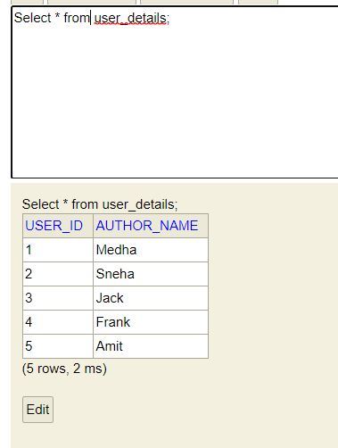

   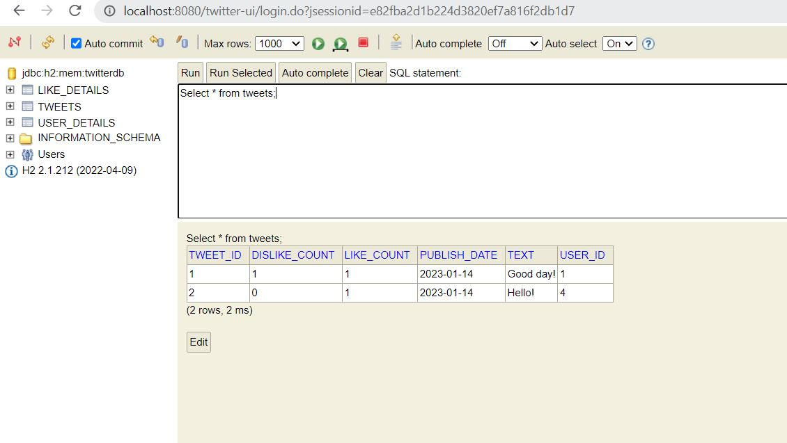

   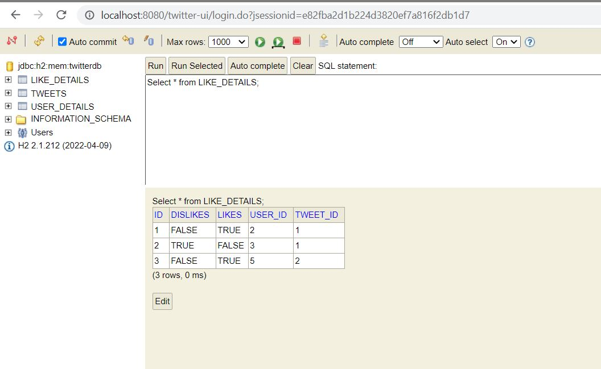   

Output:
   
   Add Tweet:
   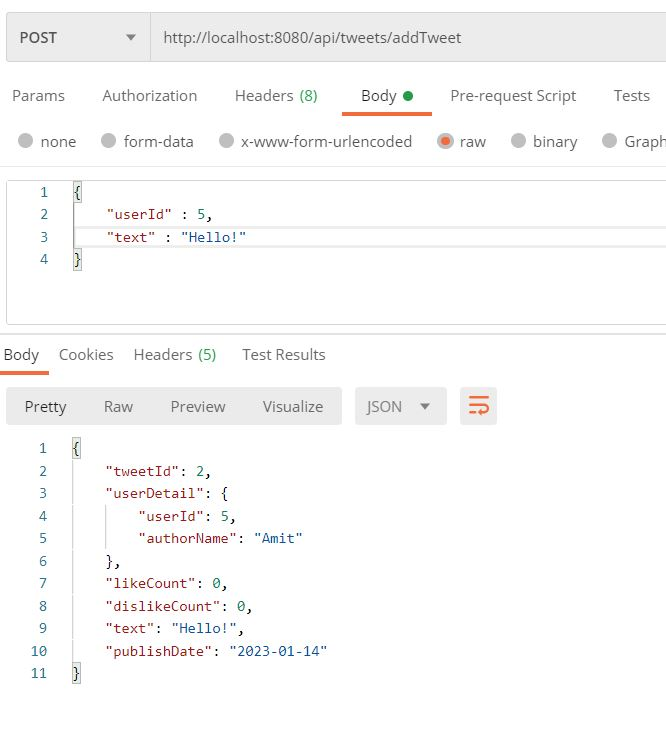
   
   Like Tweet:
   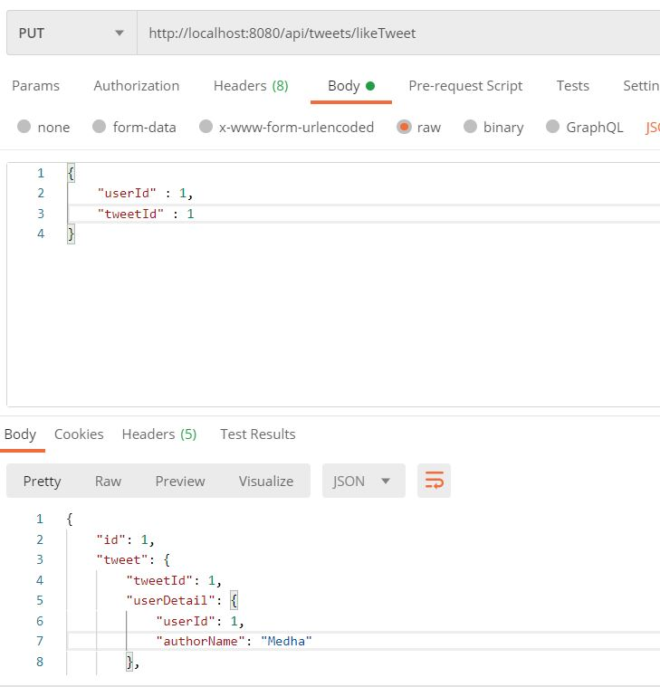
   
   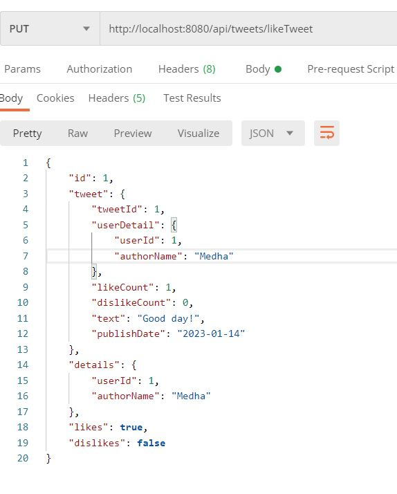

   Dislike Tweet:
   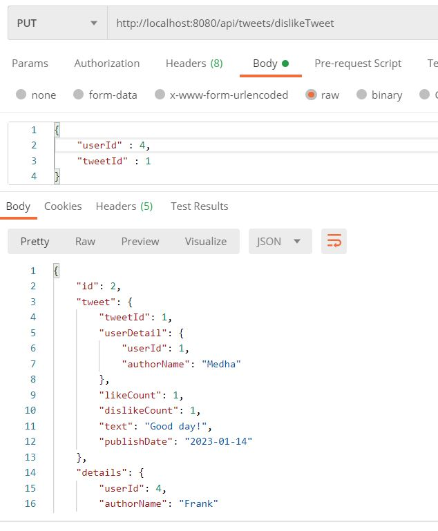
   
   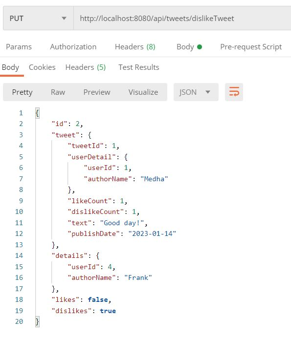   

   Get Details:
   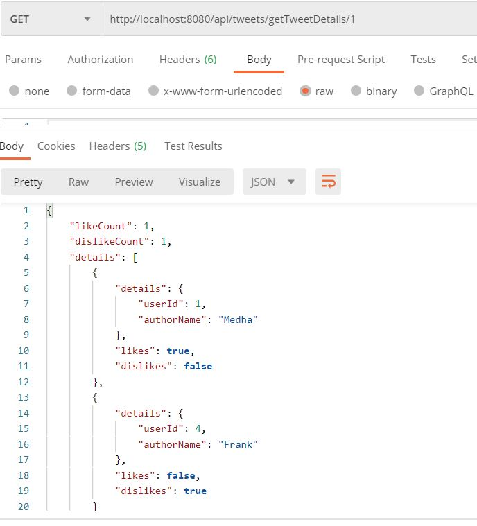
   
   Get All Tweets:
   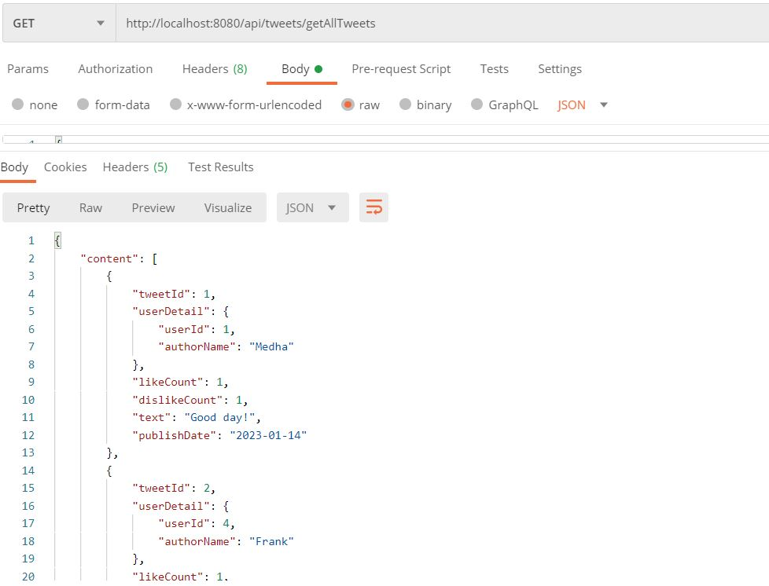
   
   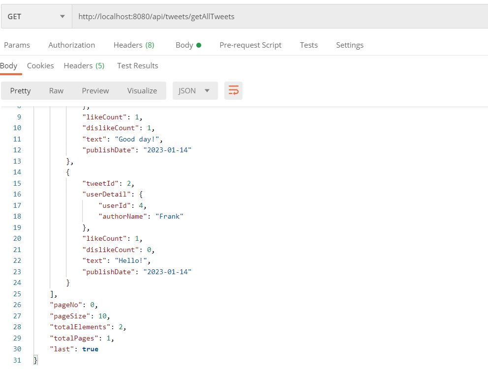
